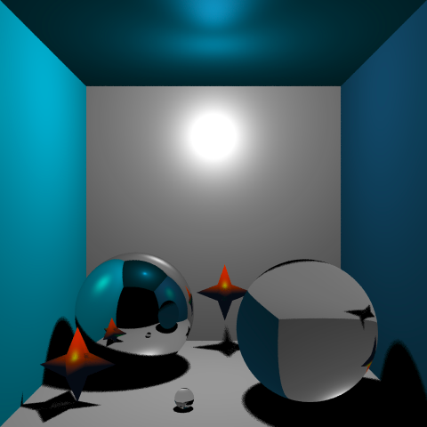
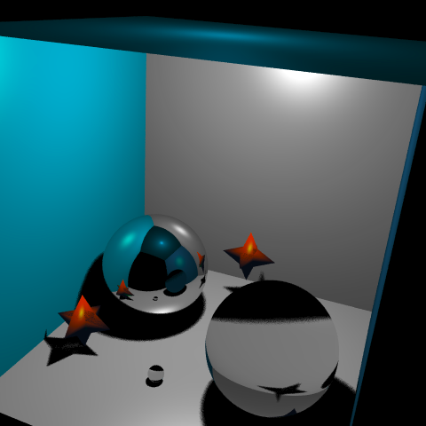

# Raytracer 

## Mode d'emploi
> make; ./main

L'utilisateur peut modifier la scène a rendre avec **+** , la première scène contient une **boîte de Cornell** améliorée, la deuxieme n'est composée que d'**une sphere**, la troisième **un quad** et enfin la dernière scène contient un **maillage** chargé dans une **boîte de Cornell**. Pour faire un rendu de la scène, l'utilisateur doit appuyer sur **r**, le fichier **rendu.ppm** est alors créer à la racine du projet. 

## Update Phase 2

Après le rendu de la phase 2, un refactor des structures pour stocker les informations des intersections afin d'alléger le code a été effectué:

1. Désormais un unique vecteur ``` std::vector<Mesh*> sceneObj; ``` contient tous les objets de la scène qu'ils soient des **sphères**, des **squares** ou encore des **maillages**.
2. Cette modification permet d'appeler la méthode ```intersect()``` sur chaque objet sans avoir à vérifier son type pour appeler la bonne méthode qui correspond à sa classe.
   Ainsi ```  RayIntersection inter = sceneObj[i]->intersect(ray);``` (*appelé lors du calcul d'intersections dans ```computeIntersection()``` dans Scene.h*) appelle directement la méthode **la plus spécialisée** grâce au mot-clé **virtual** et au fait que cette méthode ait été **redéfinie** pour chacun des objets (*sphere et square étant des sous-classes de mesh*). 

Les ombres douces étaient presque bien rendues: il fallait désormais retirer les intersections sur un même objet. Les ombres douces sont désormais opérationnelles, il y a également la possibilité de modifier la **résolution** de la grille échantillonnée pour l' **area-light** cela affectera alors la taille de la pénombre (*cf la fonction ```getAreaLight()``` dans le code de Scene.h*).

## Phase 3 / Phase Finale

### phase 3

Les intersections avec un maillage ont été implémentées, cependant comme il n'y a pas de structure d'accélération, calculer le rendu d'un maillage est assez long *(les fichiers utilisés pour calculer un rendu ne dépassaient pas quelques dizaines de KB)*.

La normale du point d'intersection est interpolée avec les coordonées **barycentriques** du triangle sur lequel il se trouve:

```c++
 // w0, w1 et w2 sont les coordonées barycentriques du triangle
Vec3 interpN = currentIntersection.w0 * vertices[triIndex[0]].normal +
                currentIntersection.w1 * vertices[triIndex[1]].normal + 
                currentIntersection.w2 * vertices[triIndex[2]].normal; 
 interpN.normalize();
```

Il fallait aussi ajouter un petit facteur d'échelle (*précisé dans la base de code fournie*) lors de la création du triangle dans le calcul d'intersection avec le mesh pour éviter les imprécisions au rendu (*```intersect()``` dans Mesh.h*).

### phase finale

Le calcul du rendu de la sphere **réfléchissante** et de celle **transparente** a été implémenté, sur les captures d'écrans ci-dessous la récursivité du lancé de rayons est de **profondeur 2**, l'utilisateur peut modifier cette valeur afin d'ajouter ou enlever des rebonds aux rayons et ainsi modifier l'aspect final de la sphère réfléchissante.

La scène de la phase finale est une boite de **cornell** à laquelle on a ajouté une **sphère transparente ** plus petite ainsi que deux **maillages** chargés à partir de la [bibliothèque](https://seafile.lirmm.fr/d/63e408a83eea4e21b60a/) (*star.off* est utilisé dans cette scène).

Les ombres calculées sur les maillages sont correctes, néanmoins il restes quelques imprécisions visibles.

|  |  |
| ------------------------------------------------------------ | ------------------------------------------------------------ |

